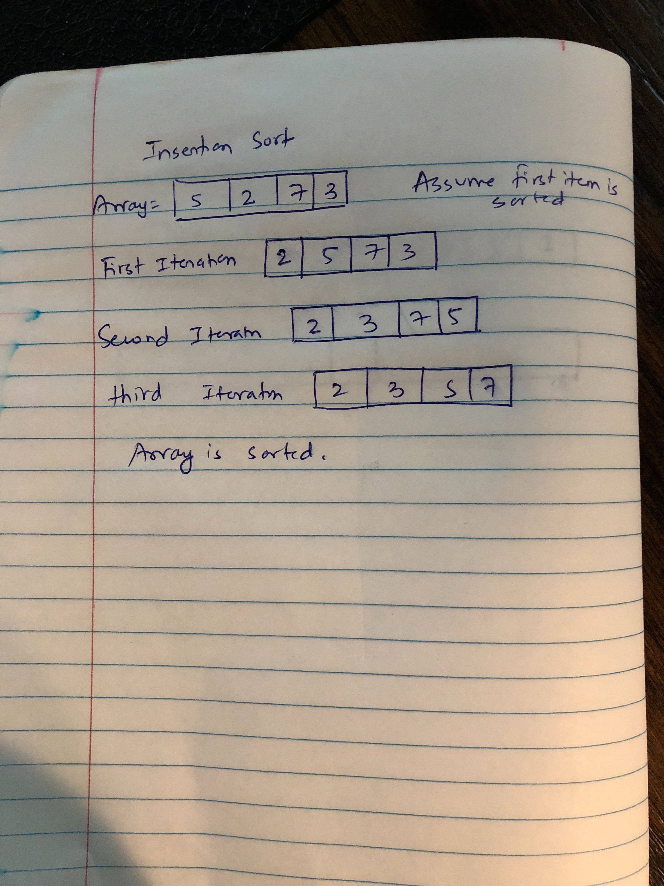
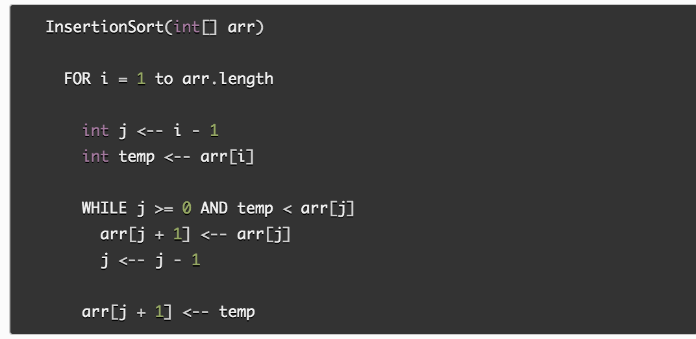

## Blog Notes: Insertion Sort
Insertion sort is the most basic sorting algorithm available. It builds the final list by iterating making one repetition at a time. It iterates over each element and places it to it's respective position.
  * [Code](https://github.com/jManij/data-structures-and-algorithms/blob/master/code401challenges/sort/src/main/java/sort/InsertionSort.java)
  * [Test](https://github.com/jManij/data-structures-and-algorithms/blob/master/code401challenges/sort/src/test/java/sort/InsertionSortTest.java)

## Learning Objectives
To understand how insertion sort works.

## Information Flow

Main Point
Supporting Points
Another main point
More details
Go here

## Diagram

## Algorithm
The algorithm is less efficient than other sorting algorithms such as quiksort, heapsort, etc since it goes through each element to find the right spot. That is O(n^2). Even if the array is sorted, the algorithm goes through each elements and puts it back to the same place. When people manually sort playing cards, most use a method similar to insertion sort. 

## Pseudocode

## Readings and References
###### Watch
  * [Video](https://www.youtube.com/watch?v=i-SKeOcBwko)

###### Read
  * [Article 1](https://www.khanacademy.org/computing/computer-science/algorithms/insertion-sort/a/insertion-sort)
  * [Article 2](https://medium.com/@hitherejoe/algorithms-insertion-sort-eec0e245ec42)

###### Bookmark
  * [Website](https://www.freecodecamp.org/news/everything-you-need-to-know-about-insertion-sort-algorithm/)
