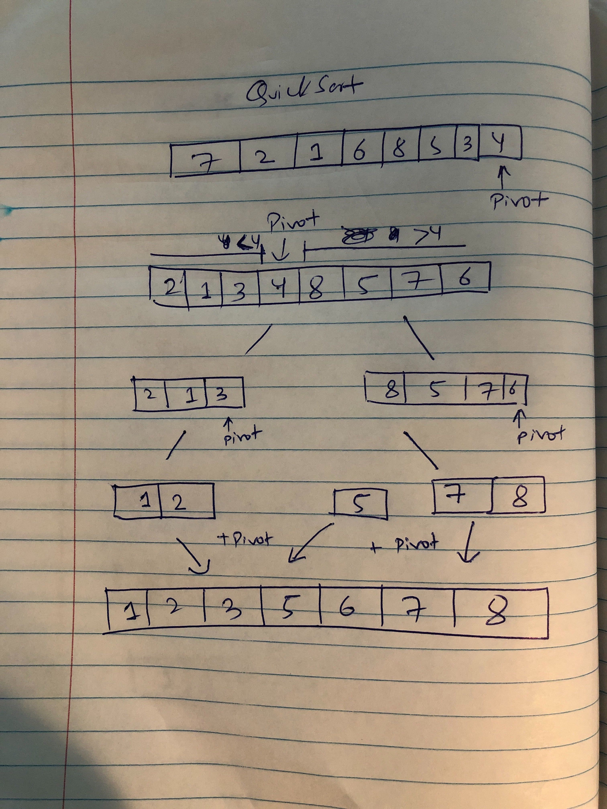
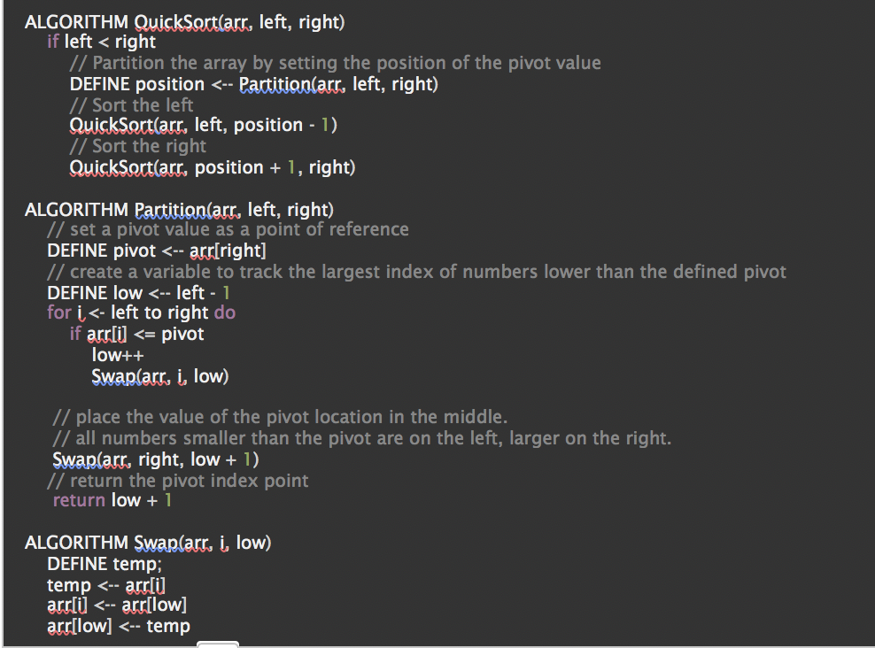

## Blog Notes: Quick Sort
Quick Sort is a divide-and-conquer approach of sorting algorithm. 
  * [Code](https://github.com/jManij/data-structures-and-algorithms/blob/master/code401challenges/sort/src/main/java/sort/QuickSort.java)
  * [Test](https://github.com/jManij/data-structures-and-algorithms/blob/master/code401challenges/sort/src/test/java/sort/QuickSortTest.java)

## Learning Objectives
To understand how quick sort works.

## Information Flow

* Main Point
  * Quick Sort uses divide-and-conquer approach, hence it is a recursive solution.

* Another main point
  * It divides by choosing element in the subarray, called pivot.
  * It arranges such, the left side is smaller and the right side is greater than the pivot.
  * Finally, conquers by recursively sorting the sub arrays. 

## Diagram

## Algorithm
The algorithm is less efficient than other sorting algorithms such as quiksort, heapsort, etc since it goes through each element to find the right spot. That is O(n^2). Even if the array is sorted, the algorithm goes through each elements and puts it back to the same place. When people manually sort playing cards, most use a method similar to insertion sort. 

## Pseudocode

## Readings and References
###### Watch
  * [Video](https://www.youtube.com/watch?v=COk73cpQbFQ&t=878s)

###### Read
  * [Article 1](https://www.vogella.com/tutorials/JavaAlgorithmsQuicksort/article.html)
  * [Article 2](https://www.pythoncentral.io/quick-sort-implementation-guide/)

###### Bookmark
  * [Website](https://www.geeksforgeeks.org/tag/quick-sort/)
