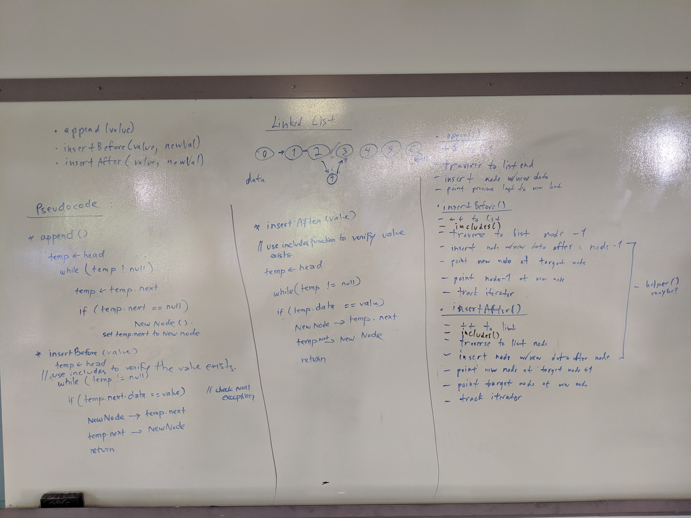

# Challenge Summary
Linked List Implementation Extended

## Challenge Description
Create three methods append, insertBefore & insertAfter in conjunction with previous
methods. 
append: Takes in a value and append the value to the end of the list
insertBefore: Takes in newValue and value, insert newValue before the value node.
insertAfter: Takes in new value and value, insert newValue after the valude node.

## Approach & Efficiency
<!-- What approach did you take? Why? What is the Big O space/time for this approach? -->
O(N) since at worst scenario, we iterate over the whole list
## Solution
<!-- Embedded whiteboard image -->

