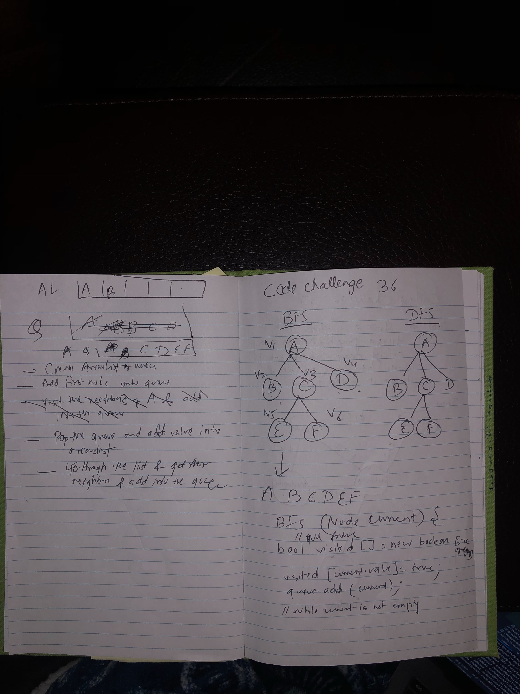

# Binary Search
Implement Breadth First Search on the Graph

## Challenge
Given a graph, use BFS to obtain the array of values in the graph. 

## Approach & Efficiency
- Adopted the neighbors method
- Collect neighbors from the starting node, and put them in queue
- Go through the queue and go through their neighbors and add them in the queue
- Dequeue and add into the arraylist
- Repeat the process untill all the values are obtained
- Time complexity and space complexity is O(N) since all the nodes are visited.

## Solution

