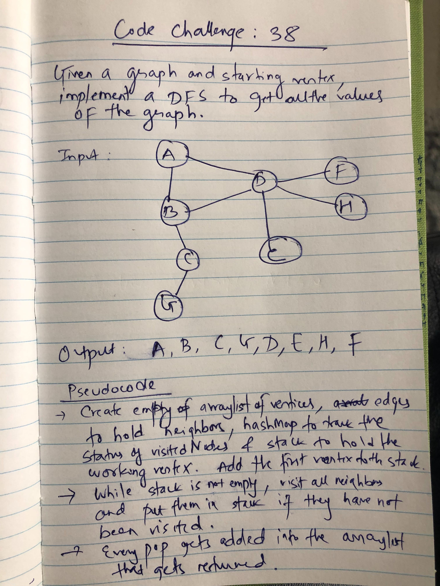

# Code Challenge 38
Implement DFS on a graph.

## Challenge
Given a graph, and the vertex to start from, implement Depth-First-Search on that graph.

## Approach & Efficiency
- Created arraylist of vertices to hold the return value, arraylist of edges to hold 
  all neighbors, HashMap to track the visit status of the vertex and Stack to hold working vertex.
- Immediately add the first provided vertex to the stack, update the visit status.
- Add the newly popped vertex into the return arrayList that holds the vertices.
- Get the neighbors and check if they have been visited, if not push them into stack.
- Repeat until stack is empty.
- Return the arraylist that holds the vertices.
- Space is O(N) 
- Time is O(N) since we might be visiting all the nodes. 

## Solution

