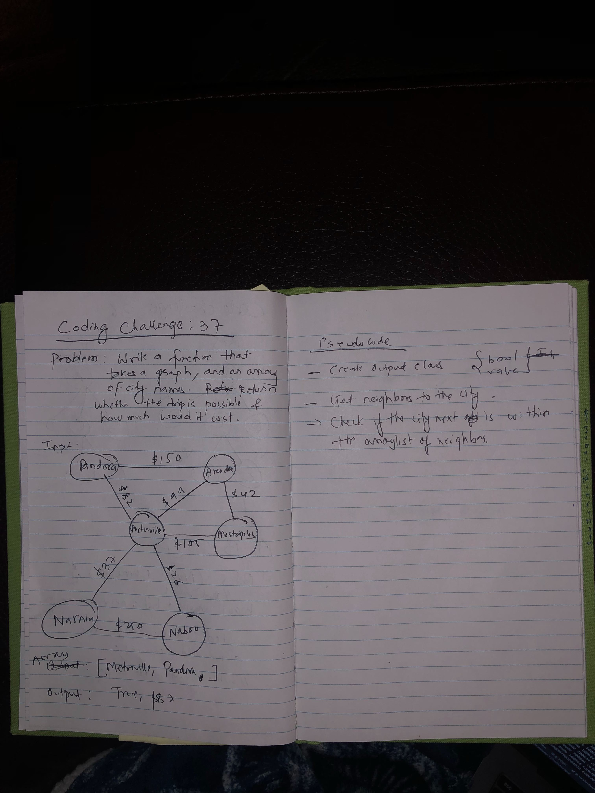

# Code Challenge 37
Check if a direct flight is possible.

## Challenge
Given a graph, and an array of cities, find out if the direct flight is possible between the cities.
Also, find the total cost.

## Approach & Efficiency
- Created an output class that has boolean value and integer value (this represents the total weight)
- Get the arraylist of all the neighbors to the starting city.
- Check to see if the next city in the array of cities is contained within the arraylist of neighbors.
- If it does not exist, return immediately with new output annotating boolean false and cost equal to zero.
- If it exists, iterate over the edges and add the weight that belongs to the vertex (city).
- Time is O(N) since we might have to visit all the nodes. Space is O(N).

## Solution

