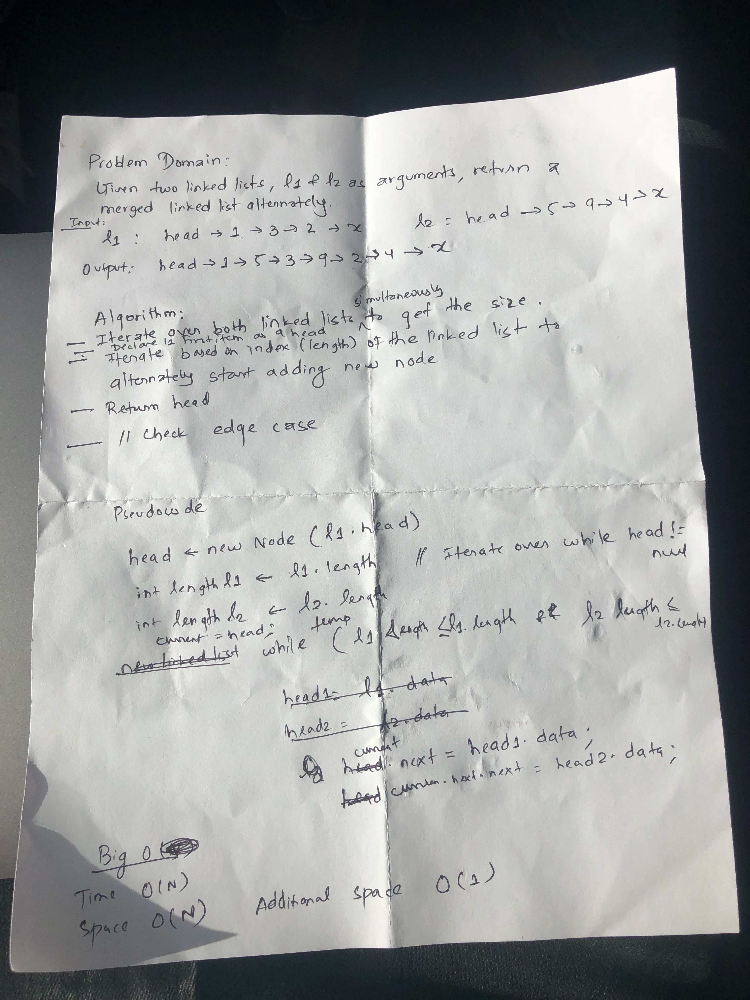

# Challenge Summary
Linked List Implementation Extended

## Challenge Description
Create a method for the Linked List class which takes a number, k, as a parameter. Return the node’s value that is k from the end of the linked list. 

## Approach & Efficiency
<!-- What approach did you take? Why? What is the Big O space/time for this approach? -->
O(N) since at worst scenario, we iterate over the whole list for time complexity
O(1) for space complexity since we are not storing the contents of the linked list when we traverse.
## Solution
<!-- Embedded whiteboard image -->

