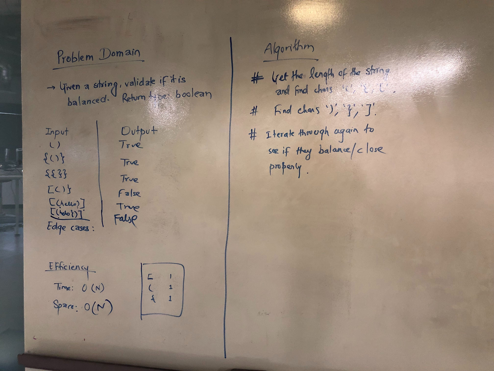

# Challenge Summary
Code challenge: 13 Multi-bracket validation

## Challenge Description
Implement a method to validate wheter a given string is balanced or not.
There are 3 types of brackets: round, squae and curly.
## Approach & Efficiency
<!-- What approach did you take? Why? What is the Big O space/time for this approach? -->
- Iterate through the strings character by character to push every open braces brackets.
- Once done with the opening braces, pop the first char to see if it matches with the most recent closing bracket.
- Determine false and return if it doesnt match.
- Return true at the end
- O(N) since at worst case, we will have to iterate over the whole string.
- O(N) for space complexity for the stack that holds the characters from the string. 
## Solution
<!-- Embedded whiteboard image -->

