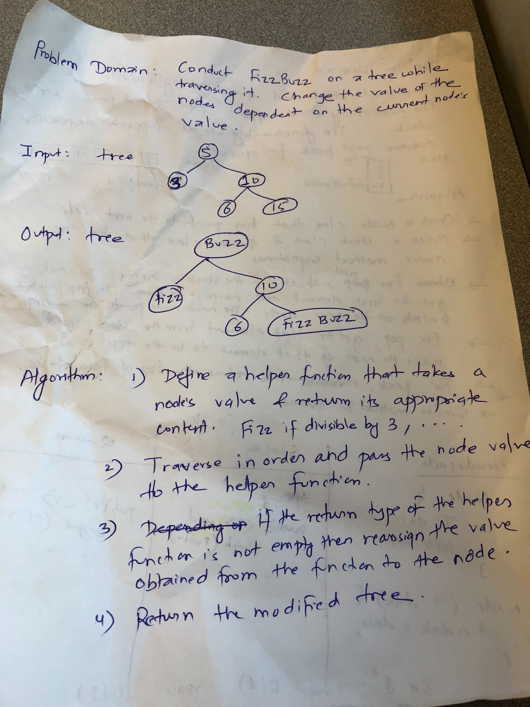

# Challenge Summary
Code Challenge: Class 16

## Challenge Description
Conduct FizzBuzz on a tree and replace the value if divisible by 3 (Fizz), by 5 (Buzz) and 15 (FizzBuzz).
## Approach & Efficiency
<!-- What approach did you take? Why? What is the Big O space/time for this approach? -->
- Iterate through the contents of the tree (via inorder traversal) and send each content to a helper method.
- Helper method returns a string depending on the value passed or an empty string.
- An empty string notifies no changes needed whereas any other string should be an indicator of replacing the value. 
- O(N) since at worst case, we will have to iterate over the whole string.
- O(1) for space complexity since there will be one space used to hold the value of Fizz, Buzz or FizzBuzz. 
## Solution
<!-- Embedded whiteboard image -->

