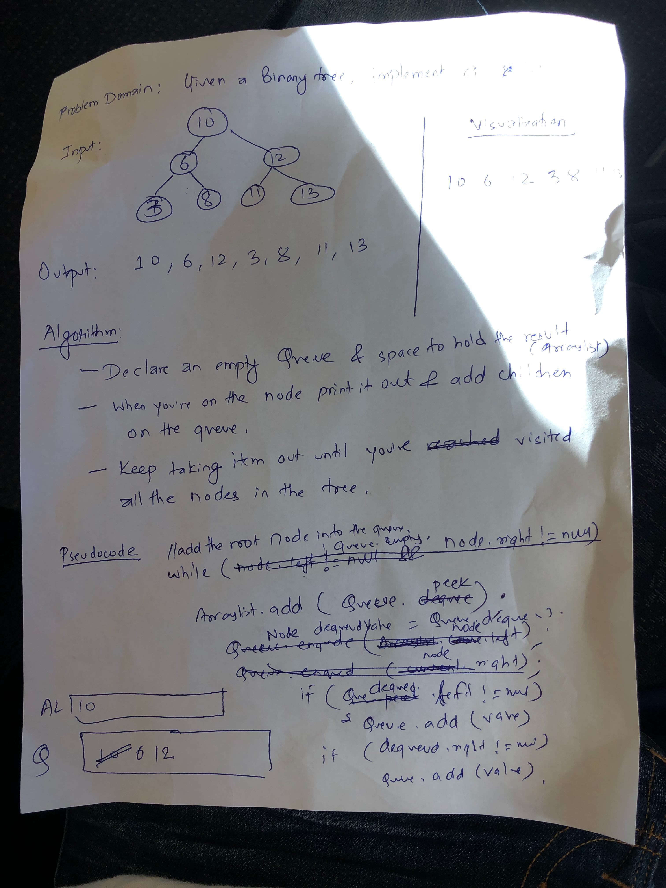

# Challenge Summary
Code Challenge: Class 17

## Challenge Description
Implement Breadth First Search on a tree and print out every node's value.
## Approach & Efficiency
<!-- What approach did you take? Why? What is the Big O space/time for this approach? -->
- Assign the root node to an empty queue.
- While the queue is not empty go through the left and right of the node and add into the queue.
- Dequeue the queue and add it to the array list of return,
- O(N) as we will have to iterate over the whole tree.
- O(N) for space complexity since there will be N space used for the queueu and return Arraylist. 
## Solution
<!-- Embedded whiteboard image -->

