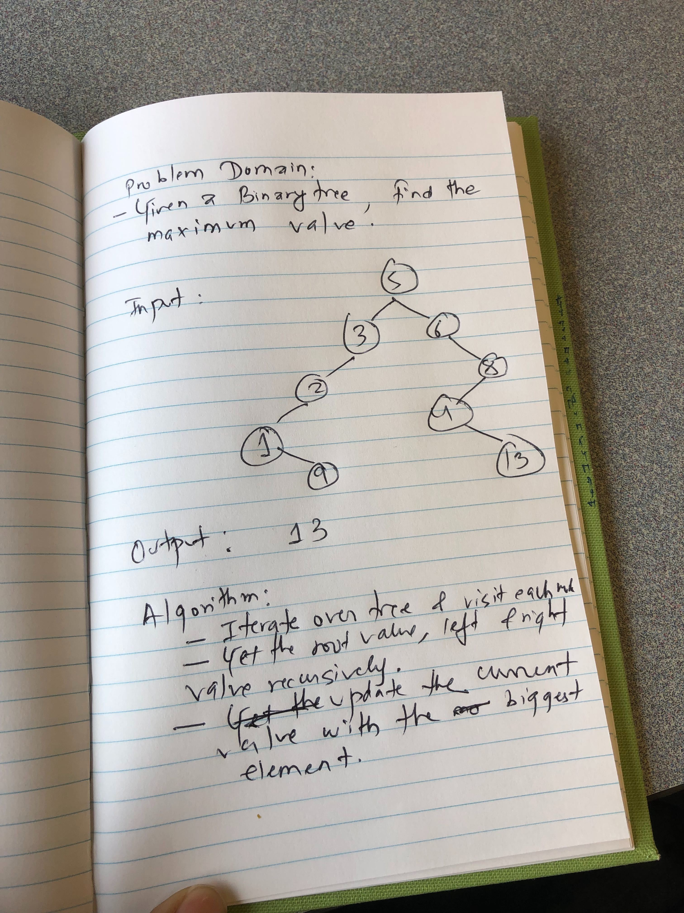

# Challenge Summary
Code Challenge: Class 18

## Challenge Description
Iterate over tree to get the maximum element int the binary tree.
## Approach & Efficiency
<!-- What approach did you take? Why? What is the Big O space/time for this approach? -->
- Iterate over tree and visit each node. Get the current, left and right value. 
- Compare the current with left and right to find the biggest element.
- Return the current value as the max value.
- O(N) as we will have to iterate over the whole tree.
- O(1) for space complexity since there will be 3 spaces used for the return value of current, left and right. 
## Solution
<!-- Embedded whiteboard image -->

#Resources Used
https://www.geeksforgeeks.org/find-maximum-or-minimum-in-binary-tree/
