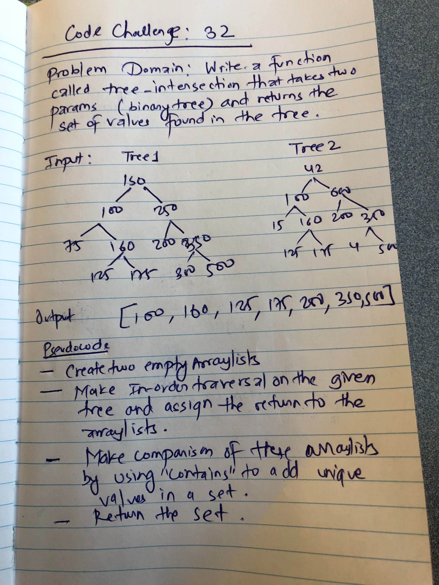

# Challenge 32
Write a function that checks for same nodes in two different binary trees.

## Challenge
- The function accepts two binary trees.
- The function iterates over the trees and find common nodes in the trees.
- The function returns the set of common nodes in two binary trees.

## Diagram

## Approach & Efficiency
- Used In-order traversal of trees.
- Stores the values of tree in the arraylists.
- Compares the lists to find common values and store in the new arraylist.
- Returns the arraylist.
- O(log N) in the worst-case time-complexity since it will have to do in-order traversal to visit each nodes in the tree.
- Space is O(N) since we are storing the values in the tree into 3 arraylists. 
