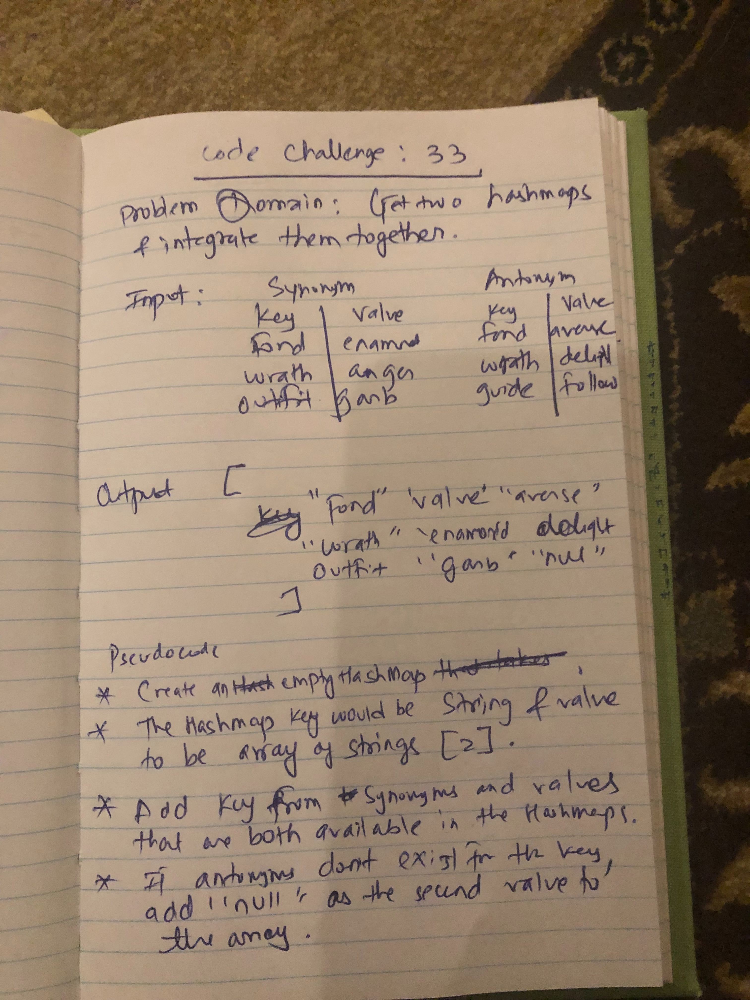

# Challenge Summary
Code Challenge: Class 33 
Write a function that LEFT JOINs two hashmap into a single data structure.

## Challenge Description
The function takes two hashmaps as parameters. Each hashMap has word Strings as keys, and a 
synonym of the key as values. The second hashmap has word Strings as keys, and antonyms of the keys
as values.The function combines the key and corresponding values into a new data structure according to
LEFT JOIN LOGIC. 

## Approach & Efficiency
<!-- What approach did you take? Why? What is the Big O space/time for this approach? -->
- Receives two hashMaps as parameters.
- Create an empty hashMap that has String as the key and array of Strings as values.
- The array of Strings will hold the value of the appropriate key for the first hashmap and seconds hashmap.
- A readable String version (toString) method is used to help with the test case.
- O(N) for time complexity since we are not visiting each hashamp more than once.
- O(N) for space complexity since there will be N space used for the final hashMap that gets returned.
<!-- Embedded whiteboard image -->

