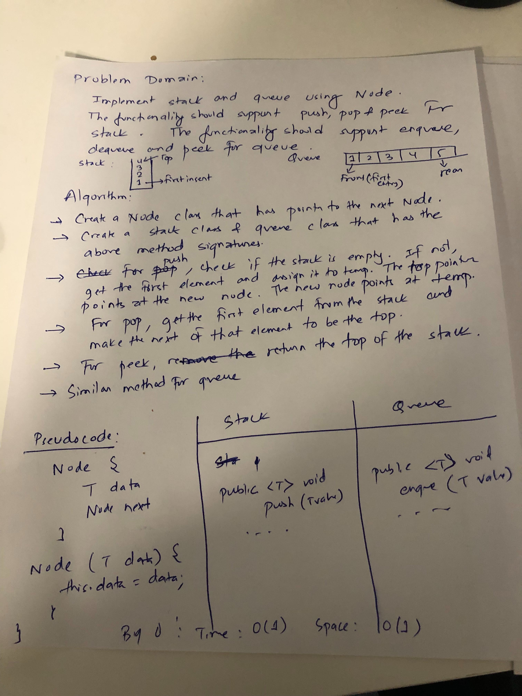

# Challenge Summary
Stack and Queue implementation using linked list.

## Challenge Description
Implement push, pop and peek method for a stack. Similarly, implement enqueue, dequeue and peek method for a queue. Alternatively, the class also has isEmpty methods to find if the given stack or queue is empty. 

## Approach & Efficiency
<!-- What approach did you take? Why? What is the Big O space/time for this approach? -->
O(1) since at worst scenario, we have reference to the first element
O(1) for space complexity since we are not storing the contents of the linked list when we traverse.
## Solution
<!-- Embedded whiteboard image -->

