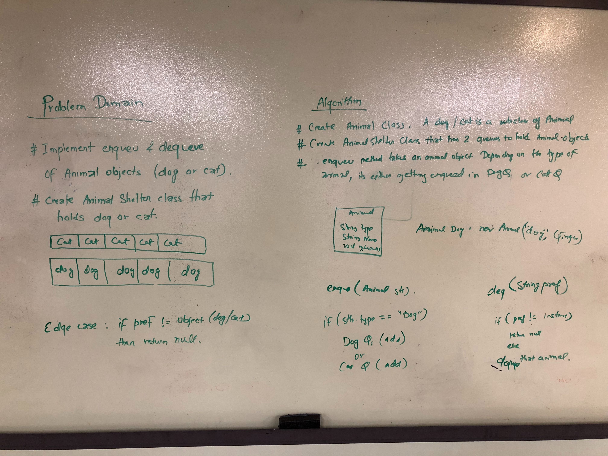

# Challenge Summary
Code challenge: 12

## Challenge Description
Implement a Queue for animal shelter. Create a package called utilities which holds
the animal Shelter class. 
## Approach & Efficiency
<!-- What approach did you take? Why? What is the Big O space/time for this approach? -->
O(1) since at worst scenario, we have reference to the first element
O(1) for space complexity since we are not storing the contents of the linked list when we traverse.
## Solution
<!-- Embedded whiteboard image -->

