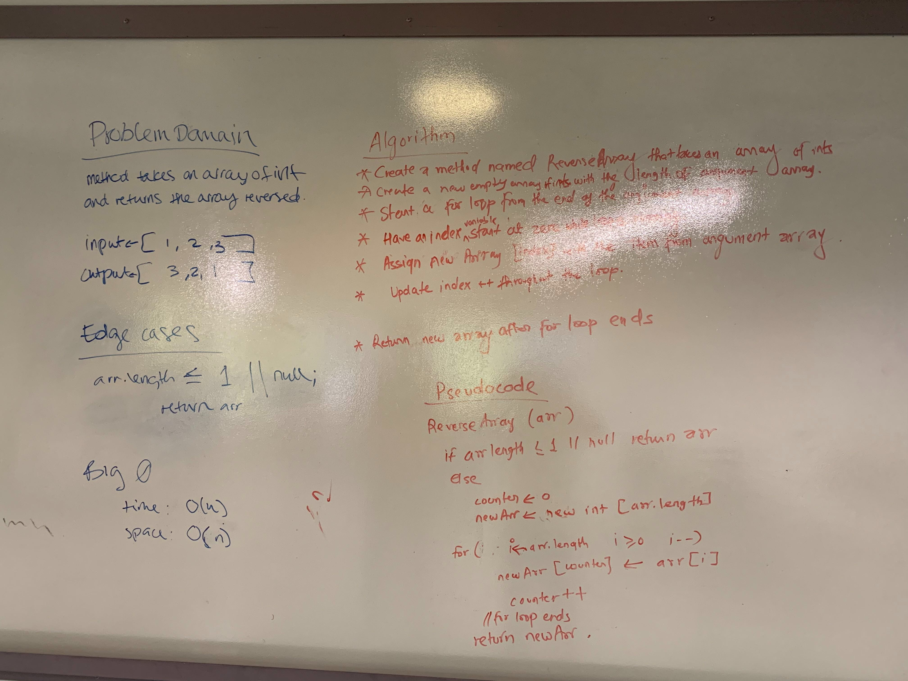

# Reverse an Array
The function reverses the array.
[Link to code](../src/main/java/code401challenges/ArrayReverse.java)

## Challenge
Given an array of integers, the method reverses the contents of the array and return the reversed array.

## Approach & Efficiency
- Created a method named Reverse Array 
- Declared an empty array with the size of the given array
- Used for loop to assign the value to the new array
- Time complexity and space complexity is O(n)

## Solution

